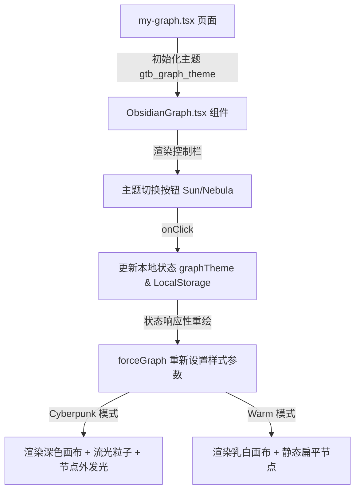

# 报告图谱双主题切换与视觉动效重构设计规格说明书

本篇设计说明书定义了在“个人市场图谱”页面中实现“暖乳砂极简图谱”与“霓虹暗黑星空图谱”双主题一键切换的系统设计。该功能在保护用户主库代码不受破坏的前提下，在隔离的 worktree 分支中开发。

---

## 1. 核心视觉主题定义 (Theme Definition)

### 1.1 暖乳砂极简图谱 (Warm Cream Theme)
*   **适用场景**：日常阅读、品类关联分析、编辑与信息沉淀。
*   **画布背景色**：柔和暖白色 `rgba(246, 243, 236, 0.4)`，并衬以 `radial-gradient` 极细微网格点阵。
*   **连线表现**：静态细线，线宽由关系类型决定，无流动粒子。
*   **高亮反馈**：节点外围有浅灰色 1.5 倍直径细折角框。
*   **侧边详情栏**：乳白半透明磨砂（`background: rgba(253, 251, 247, 0.8)`）。

### 1.2 霓虹暗黑星空图谱 (Cyberpunk Neon Theme)
*   **适用场景**：展示、演练关系推演、全局市场侦测（追求极致科技感）。
*   **画布背景色**：星夜深黑色 `#0b0f19`。
*   **连线表现**：启用流光粒子。连线类型配色转换为高饱和霓虹色：
    *   `supplier`：`rgba(56, 189, 248, 0.85)` (霓虹天蓝)
    *   `competitor`：`rgba(244, 63, 94, 0.95)` (霓虹玫瑰粉)
    *   `shared_product`：`rgba(52, 211, 153, 0.85)` (霓虹翡翠绿)
    *   `shared_channel`：`rgba(251, 191, 36, 0.85)` (霓虹琥珀金)
    *   `shared_competitor`：`rgba(167, 139, 250, 0.8)` (霓虹罗兰紫)
    *   默认其他：`rgba(148, 163, 184, 0.3)`
*   **连线流光粒子**：`linkDirectionalParticles = 3`，流速随主题动态控制。
*   **节点渲染**：为节点绘制外切霓虹发光滤镜（`ctx.shadowBlur = 12`）。当节点被选中时，以外切选中节点圆形半径 2.8 倍大小渲染四角细折线框，线框伴随 `Math.sin(Date.now() / 200) * 0.15` 进行缓慢的呼吸缩放。
*   **侧边详情栏**：暗色半透明磨砂（`background: rgba(15, 23, 42, 0.85)`），带有淡淡的霓虹发光描边。

---

## 2. 界面控制与位置布局 (Toggle Button Position)

主题切换控制按钮采用**画布内右上角浮动摆放**形式：
*   **绝对定位**：定位在 ObsidianGraph 组件 Canvas 容器的右上角（`position: absolute; top: 20px; right: 20px; z-index: 10;`）。
*   **组件设计**：圆形悬浮微型毛玻璃按钮，带有一个微弱的 `transition: all 0.3s` 的缩放光晕。
*   **按钮图标**：使用 `lucide-react` 的 `Sun` 与 `Moon`（或 `Sparkles`）进行条件图标渲染。
*   **切换范围**：点击按钮只触发布局容器内的组件级样式及 Canvas 画布的重绘更新，页面的外部 Navbar 导航栏和页脚保持全局暖白背景，互不干扰。

---

## 3. 实现架构与数据流 (Implementation & Data Flow)

### 3.1 核心状态
*   `graphTheme`: `'warm' | 'cyberpunk'` (默认值为 `'warm'`)。

### 3.2 Canvas 绘制重构
*   重写 `nodeCanvasObject` 的绘制函数，当 `graphTheme === 'cyberpunk'` 时：
    1. 激活 `ctx.shadowColor` 与 `ctx.shadowBlur` 滤镜，增强发光效果。
    2. 针对非高亮节点的透明度乘以 `0.12`，使得图谱中高亮部分的霓虹聚光效果更具层次。
*   在 `linkWidth`、`linkColor` 属性上，引入依赖 `graphTheme` 的分支表达式。

---

## 4. 验证与成功标准 (Verification & Success Criteria)

*   **编译验证**：`npx tsc --noEmit` 100% 通过无报错。
*   **手动测试（真实数据验证）**：
    1. 打开图谱页面，画布右上角正常显示“主题切换”浮动按钮。
    2. 点击切换为 Cyberpunk 模式，画布背景色流畅黑化，连线瞬间长出游动粒子，节点发光正常，高亮选择四角框伴随呼吸起伏。
    3. 点击切换回 Warm 模式，画布背景色和连线瞬间恢复轻盈暖白色，粒子游动停止。
    4. 刷新网页，图谱能够读取 `localStorage` 恢复刷新前的主题设置。
