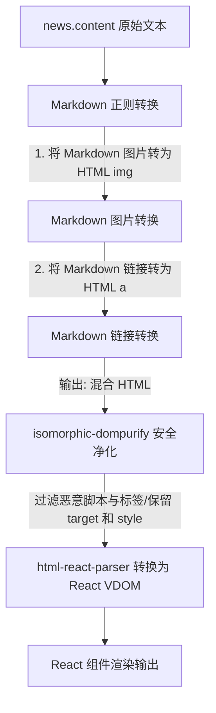

# 设计文档：安全升级新闻详情页以支持 HTML 富文本渲染

## 1. 背景与目标
在 Globaltradebuddy 新闻详情页中，当前直接以纯文本形式渲染富文本标签源码。为了在提升用户体验的同时确保系统的安全性，我们将升级 `renderContent` 逻辑，以在 SSR（服务端渲染）和 CSR（客户端渲染）环境下安全地解析并渲染 HTML 内容，同时兼容历史录入的 Markdown 图片和链接。

## 2. 安全与架构原则
* **严禁危险操作**：绝对不使用 React 内置的 `dangerouslySetInnerHTML` 属性，防止反射型/存储型 XSS 漏洞。
* **高安全性净化**：使用 `isomorphic-dompurify` 进行富文本消毒过滤，剔除恶意脚本（如 `<script>`，`onerror` 属性等）。
* **SSR 同构支持**：所用库必须同时支持 Node.js 服务端渲染和浏览器客户端渲染，不得在服务端因缺乏 `window`/`document` 对象而崩溃。

## 3. 设计方案

### 3.1 依赖安装
引入以下两个同构安全解析库：
* `html-react-parser`：安全解析 HTML 字符串并转换为 React 虚拟 DOM 节点。
* `isomorphic-dompurify`：同构 DOMPurify，在 Node.js 服务端使用 JSDOM，在客户端使用原生 DOM 净化 HTML。

### 3.2 兼容渲染逻辑 (方案 1)
为了同时兼容历史录入的 Markdown 语法，并且允许未来新插入的富文本 HTML，我们在渲染前需要经过以下处理流程：



#### Markdown 正则替换逻辑
* **图片替换**：
  * 正则：`/!\[(.*?)\]\((.*?)\)/g`
  * 替换目标：``
* **链接替换**：
  * 正则：`/\[(.*?)\]\((.*?)\)/g`
  * 替换目标：`<a href="$2" target="_blank" rel="noreferrer" style="color: var(--color-accent); text-decoration: underline; font-weight: 500;">$1</a>`

#### HTML 净化与解析配置
```typescript
import parse from 'html-react-parser';
import DOMPurify from 'isomorphic-dompurify';

const renderContent = (content: string) => {
  if (!content) return null;

  // 1. 先做 Markdown 到 HTML 的预转换
  let htmlContent = content
    .replace(/!\[(.*?)\]\((.*?)\)/g, '')
    .replace(/\[(.*?)\]\((.*?)\)/g, '<a href="$2" target="_blank" rel="noreferrer" style="color: var(--color-accent); text-decoration: underline; font-weight: 500;">$1</a>');

  // 2. isomorphic-dompurify 消毒，特别需要允许 target、rel 属性以及 style 行内样式
  const cleanHtml = DOMPurify.sanitize(htmlContent, {
    ADD_ATTR: ['target', 'rel', 'style'],
  });

  // 3. 将净化后的 HTML 解析为 React VDOM
  return (
    <div className="news-content-wrapper">
      {parse(cleanHtml)}
    </div>
  );
};
```

## 4. 规格自我审查
* **有无占位符**：无。
* **安全性验证**：已确认 `isomorphic-dompurify` 默认过滤掉所有可能导致 XSS 的恶意载荷，只保留安全的 HTML 结构。
* **SSR 同构验证**：`isomorphic-dompurify` 内置支持 Node 环境；`html-react-parser` 是纯前端 VDOM 解析，在 Next.js 服务端能正常输出 HTML。
