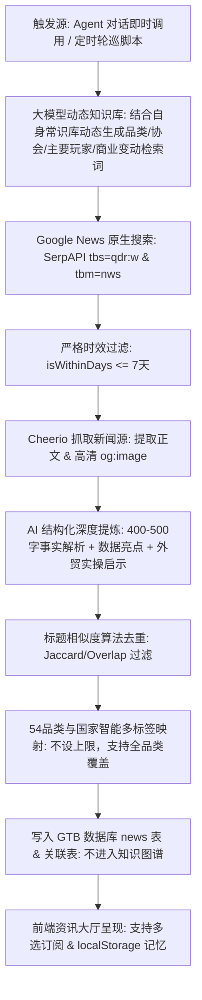

# 设计文档：GTB 54品类实时资讯引擎与 report-news 技能全量升级

## 1. 概述与背景

当前 GlobalTradeBuddy (GTB) 项目中的 `report-news` 技能主要基于简单的文本 Prompt 约束，缺乏工程化数据抓取与时效控制，容易导致生成的新闻时效性不足、链接失效、缺少真实配图，且无法针对 GTB 平台 54 个标准品类进行垂直化、高时效的精准情报分发。

本设计方案参考了成熟的零售资讯聚合架构（SerpAPI + 7天时效硬过滤 + Cheerio 真实 og:image 提取 + 中国出口商视角深度提炼），将整套引擎 100% 自包含打包于 GTB 项目与 `.antigravity/skills/report-news/` 技能中，同时升级前端资讯大厅支持“品类多选订阅与状态记忆”。

---

## 2. 系统核心架构与数据流



---

## 3. 详细设计与模块划分

### 3.1 技能自包含设计 (`.antigravity/skills/report-news/`)

在技能目录下封装完整的规则与执行引擎，确保 Agent 在对话中可即时调用，也可由 Node 独立脚本触发：

```
.antigravity/skills/report-news/
├── SKILL.md                 # 技能工作流、Prompt 模板、大模型动态检索生成规范、54品类智能多标签打标规则
└── scripts/
    └── fetch-news.js        # 自包含 Node 执行脚本 (Google News抓取 + og:image解析 + AI深度提炼 + 直写GTB)
```

#### 1) 搜索与过滤逻辑 (`scripts/fetch-news.js`)
* **大模型动态生成检索词（核心）**：
  * 充分发挥大模型自身对 54 个品类的世界知识（包括大模型知晓的具体海外品牌名、主要大卖场渠道、垂直行业协会、专业术语等）；
  * 在大模型自身知识库的基础上，系统化要求大模型**自动融入**：
    1. **主要玩家与头部品牌**（Key Players / Brands）；
    2. **行业协会与官方机构**（Trade Associations / Standard Bodies）；
    3. **重大商业与人事变动**（`leadership`, `CEO`, `expansion`, `store openings`, `investment`, `acquisition`, `earnings`）；
    4. **政策与外贸链条**（`tariff`, `compliance`, `supply chain`, `recall`）。
* **Google News 接口**：调用 SerpAPI，固定配置 `engine: 'google'`, `tbm: 'nws'`, `tbs: 'qdr:w'`（强制 1 周内）。
* **代码级日期强制拦截 (`isWithinDays`)**：
  * 支持 `X hours ago`, `today`, `yesterday`, `X days ago`（<=7天）；
  * 对解析不出日期或超过 7 天的历史新闻**坚决过滤排除**。
* **真实配图与正文抓取 (`scrapeContent`)**：
  * 使用 Node 原生 `fetch` 请求目标新闻链接，超时保护 5 秒；
  * 使用 `cheerio` 优先提取 `<meta property="og:image">` 高清封面，无图时回退至 Google 缩略图。

#### 2) 400~500 字深度商业情报提炼规范
大模型提炼严格遵循面向中国出口制造企业的深度结构：
* **Title**：精准标题（含涉及的核心品牌、行业协会、零售渠道名）；
* **Recap（深度事实与背景剖析，400~500字）**：
  * 详细阐述事件全貌、来龙去脉、具体涉及的数据/金额/门店数量/关键决策；
  * 深入报道行业协会权威数据、头部玩家战略动向（如**人事调整、CEO变动、新店扩张/闭店、重大投资收购、供应链转向**等）；
* **Highlights**：3~5 个关键数据指标与事实亮点；
* **Takeaways（150~200字实操启示）**：深入分析对中国出口工厂选品、BOM成本控制、关税规避、买家谈判的落地指导；
* **Tags & Industries（智能多标签，无数量上限）**：
  * 从 GTB 54 个标准品类全量候选列表中，**根据新闻实际影响范围进行完整智能匹配**，不设置 1~3 个的数量上限；
  * 针对 Home Depot、Walmart 等大型综合商超的战略级动态，自动关联其覆盖的全部相关品类（可达十几个或二十几个品类）；
  * 针对周六、周日的宏观海运与合规大盘要闻，**自动关联全部 54 个品类**，确保所有品类的外贸用户都能在其订阅流中看到。

---

### 3.2 54 品类、行业生态与周末宏观排期规划

| 周期 | 核心覆盖板块与品类 | 大模型检索生成侧重与行业生态 | 品类标签关联规则 |
| :--- | :--- | :--- | :--- |
| **周一** | **电子家电与智能出行**<br>（家用电器、电子消费品、照明、新能源车、汽摩配…） | 大模型调动自身常识库，结合家电协会(AHAM)、汽配协会(Auto Care Assoc)、连锁卖场(Best Buy, AutoZone, MediaMarkt)的开店、投资及高管变动。 | 动态匹配涉及的所有相关电子/汽配品类 |
| **周二** | **五金工具与机械建材**<br>（五金、工具、通用机械、工业自动化、建材、卫浴…） | 大模型调动自身常识库，结合五金制造协会、建材大卖场(Home Depot, Lowe's, Leroy Merlin, Bauhaus)供应链调整、新店与采购政策。 | 动态匹配涉及的所有五金、工具、建材、卫浴等多品类 |
| **周三** | **日用百货与餐厨陶瓷**<br>（餐厨器皿、日用陶瓷、家居用品、玻璃工艺、礼品赠品…） | 大模型调动自身常识库，结合全球百货与折扣超商(Walmart, Target, Dollarama, Action, B&M, TJX)杂货采购、季度财报与陈列 SKU 调整。 | 动态匹配涉及的所有轻工日百品类（可多达10~20个） |
| **周四** | **家居家具与园林装饰**<br>（家具、家居装饰、园林用品、石材铁艺、地毯挂毯…） | 大模型调动自身常识库，结合家具协会(AHFA)、宜家(IKEA)、Ashley、Wayfair、欧美林业与 EUDR 木制品法案、户外庭院市场。 | 动态匹配涉及的所有家居家具、装饰、园林等多品类 |
| **周五** | **服装纺织与母婴个护**<br>（男女装、童装、纺织面料、鞋、箱包、玩具、宠物用品、个护…） | 大模型调动自身常识库，结合玩具协会(Toy Association)、宠物协会(APPA)、服装零售商(Zara, H&M, Shein, PetSmart)开店、人事、面料合规动态。 | 动态匹配涉及的所有服装、母婴、宠物等品类 |
| **周六** | **【全球海运与宏观外贸大盘周报】** | 全球集装箱运价走势（SCFI, Drewry WCI）、红海/巴拿马运河、主要欧美港口与主要结算汇率周度波动。 | **全品类覆盖（自动关联全部 54 个品类）** |
| **周日** | **【全球外贸合规预警与下周日历前瞻】** | 近期欧美生效法规（EUDR, CBAM碳关税, FDA等）、海外采购季备货倒计时、全球重点外贸展会日程。 | **全品类覆盖（自动关联全部 54 个品类）** |

---

### 3.3 前端资讯大厅优化 (`pages/news/index.tsx`)

1. **品类多选筛选器（我的专属订阅流）**：
   * 将单选切换改造为多选 Tag 选择器，用户可自由组合勾选多个品类（如：`[五金]` + `[工具]` + `[汽车配件]`）。
2. **用户选择持久化记忆 (`localStorage`)**：
   * 首次加载：优先读取用户登录信息中的偏好行业（若无则默认展示全部）；
   * 用户每次点击切换多选时，通过 `localStorage.setItem('gtb_selected_industries', JSON.stringify(selected))` 自动持久化；
   * 用户刷新或下次打开页面时，100% 自动还原上次选中的品类流。

---

### 3.4 数据隔离与知识图谱保护

* **数据表解耦**：资讯数据完全保存在 `news`、`news_industries`、`news_countries` 表中；
* **知识图谱隔离**：个人图谱（`my-graph`）仅读取 `reports` 商业研报，绝对不引入 `news` 产生任何圆点或连线，确保知识图谱的干净与专业性。

---

## 4. 验证与测试计划

1. **时效与链接测试**：
   * 运行 `fetch-news.js` 测试指定品类（如“宠物用品”），验证抓取的新闻是否均为真实海外新闻 URL，日期均在 7 天以内。
2. **配图与内容提炼测试**：
   * 检查提取到的 `og:image` 是否为真实有效的图片 URL；
   * 检查生成的内容是否满足 400~500 字深度事实解析（包含协会/玩家/开店/人事等关键动态）以及外贸实操启示。
3. **多标签入库测试**：
   * 验证对于商超大事件（如 Home Depot 战略），`news_industries` 是否能够灵活关联 10 个以上的相关品类；
   * 验证对于周六日海运与合规宏观资讯，是否正确全量关联 54 个品类。
4. **前端多选与记忆测试**：
   * 打开 `http://localhost:3000/news`，测试多选勾选品类，刷新页面验证是否成功记住勾选状态。
